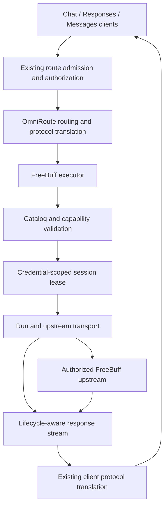

# FreeBuff architecture

Status: **selected design direction; not implemented or live-validated**. This is the fork's
design, separate from the inherited [OmniRoute architecture](architecture/ARCHITECTURE.md).
See [audit evidence](FREEBUFF_AUDIT.md), [decisions](DECISIONS.md),
[implementation packets](IMPLEMENTATION_PLAN.md), and [current status](STATUS.md).

## Objective and feasibility boundary

Keep OmniRoute's normal routing, credentials, UI, and protocol conversion. Improve the native
FreeBuff adapter rather than maintaining another gateway. The default architecture is A:
client → OmniRoute → native FreeBuff modules → authorized upstream interface.

There is a material upstream restriction, not merely an implementation gap. At official source
revision `29cb7f7aaef37343a45b0cd7d79acb721919dc16`,
`common/src/constants/foreign-client-signals.ts` explicitly detects third-party tool names,
toolsets, and system prompts and implements a downgrade decision. Its comments explicitly describe
third-party use of that endpoint as prohibited. This is source evidence, not a separately verified
legal interpretation or an authenticated observation of production behavior.

Consequently **a valid token alone does not establish permitted Codex/Pi/OpenCode access to the
requested FreeBuff model**. Packet P0 must establish an authorized integration contract before
enabling live free-mode gateway support. Do not rename tools, fabricate official-client identity,
simulate ads, forge engagement, or cycle accounts/IPs to defeat those restrictions. Do not return a
successful answer labeled as the requested model when upstream actually downgraded it. A bridge
does not remove this constraint. If no permitted interface exists, finish the offline hardening
and use OmniRoute's other legitimately available providers for coding clients.

## Request flow and ownership

Responses and Anthropic stay client-facing formats. The provider's upstream format remains
OpenAI Chat Completions unless P0 establishes a different authorized contract. Existing entry
points delegate into the shared handler; no parallel Responses or Anthropic server is planned.

### Proposed modules (new paths, not current features)

Keep `open-sse/executors/freebuff.ts` as a small orchestrator. Put provider-local modules under
`open-sse/executors/freebuff/`:

| Module                           | Contract                                                                           |
| -------------------------------- | ---------------------------------------------------------------------------------- |
| `types.ts`, `schemas.ts`         | Typed, Zod-validated wire responses; explicit unknown states                       |
| `client.ts`                      | Injected fetch, allowed upstream URLs, headers, deadlines, bounded body reads      |
| `errors.ts`                      | Stable sanitized error codes, retry hints, failure scope and replay safety         |
| `catalog.ts`, `catalogParser.ts` | Validated immutable catalog; model → permitted root mapping                        |
| `sessionManager.ts`              | Credential-scoped state machine, leases, admission, polling, idle release          |
| `runManager.ts`                  | Per-request START/FINISH, exactly-once local finalization                          |
| `request.ts`                     | Preserve client messages/tools; own protected metadata; explicit capability checks |
| `responseStream.ts`              | Backpressure, cancellation, terminal detection, bounded SSE observation            |
| `runtime.ts`                     | One process-local runtime, lifecycle shutdown and credential invalidation          |
| `health.ts`                      | Sanitized counters and snapshots for existing authenticated monitoring             |

These are planned interfaces; acceptance tests, not file count, determine the final split.
Use `ExecuteInput` and `{ response }` rather than changing the executor ABI. Provider connections
remain the source of credentials. Account selection belongs to existing OmniRoute auth/routing,
not a second account pool hidden inside FreeBuff. The generic `services/sessionPool` is an
anonymous browser-fingerprint pool with different invariants; do not reuse it as an upstream
FreeBuff account-session pool.

## Credentials

Use existing configured provider credentials (`apiKey`, with the existing `accessToken` fallback).
Keep downstream OmniRoute API keys separate from upstream tokens. Runtime identity uses a stable
connection identifier plus credential generation; internally deduplicate identical credentials
with a non-exported digest to avoid two connections fighting for one upstream slot. Never log
token prefixes/suffixes, raw auth files, cookies, session IDs, or run IDs.

Prefer read-only credential validation. The current validator's session-creating POST must be
removed. The official SDK has a `/api/v1/me` read path; P0 must verify its accepted fields and
auth-error semantics. Separate invalid credentials from forbidden access, unavailable models,
and rate limits. No refresh-token grant was established by this audit; do not invent one.
Expired/revoked credentials require legitimate reauthentication through the official flow.
A future device-login UI is optional and must use the existing OAuth conventions.

## Session and run lifecycle

Conservative initial deployment: one Node process, at most **one in-flight completion per
credential and two FreeBuff completions globally**. These are proposed local safety limits,
not upstream entitlement claims. Bound the local queue to eight pending requests, maximum
30-second wait, configurable within validated limits. Acquire a usable credential lease before
START; queue cancellation must consume no session or run.

| State             | Required behavior                                                                             |
| ----------------- | --------------------------------------------------------------------------------------------- |
| Unknown / idle    | Read-only reconcile before admission; do not assume process restart means no upstream session |
| Admitting         | One shared operation per credential; followers have independent cancellation                  |
| Queued upstream   | Poll GET at upstream retry interval under one deadline; never POST-loop                       |
| Active            | Validate nonempty instance, model binding, expiry, ownership and credential generation        |
| Draining          | No new prompts after expiry; allow only already-running work under confirmed upstream grace   |
| Cooldown / denied | Respect account, model, IP, spend and consent restrictions without fresh-session loops        |
| Closed            | Cancel timers, reject waiters, finish runs, release only owned sessions                       |

The official client uses `POST /api/v1/freebuff/session/admission` for new admission and
`GET`/`DELETE /api/v1/freebuff/session` for status/release. It also publishes a dedicated
`/api/v1/freebuff/session/reuse` contract. Do not silently fall back to legacy POST when the safe
route returns 404/405. Default wallet spend cap to zero; never grant consent or take over a
different instance automatically. No Desktop multi-session flag for a non-Desktop integration.

Reconcile and reuse only an instance this integration is entitled to use. A conflicting live
instance or model lock is a bounded conflict, not permission to kill an official client session.
Keep ephemeral ownership state in memory initially; crash recovery may need a non-secret owned
instance record only if P0 shows reconciliation cannot safely recover without it. Never restore
an unvalidated cached session as active. Explicitly document the single-process requirement;
multiple workers/replicas require distributed coordination before use.

Active-session GET polling can refresh quota/expiry information. A heartbeat is distinct from
read-only polling: the official constant is 45 seconds and it writes liveness state. Enable it
only for a verified supported mode and owned session. Do not renew admissions in the background
or during active streams. Release idle owned sessions after a proposed five-minute idle timeout,
with a bounded independent cleanup signal and no account-wide DELETE.

Use one run per gateway request initially. START must yield a validated run ID; any failure
prevents chat dispatch. FINISH happens after terminal response consumption, never merely after
HTTP headers. Track success, upstream failure, client cancellation, and unknown outcome distinctly;
map them only to verified upstream status enums. Do not report a failed/aborted run as completed.
Use real observed step/usage data where supported; do not fabricate successful steps or quota data.
Shutdown drains for a bounded interval, then aborts remaining requests and makes bounded cleanup
attempts. Exactly-once is a local invariant; network loss prevents claiming remote exactly-once.

## Retries and failure scope

Do not multiply executor retries by router/account/combo retries. Each request needs one bounded
attempt budget and deadline. Reuse OmniRoute's connection cooldown, model lockout and provider
breaker classification. Add provider-specific error normalization at the boundary.

- GET status/catalog: at most two transient retries with jitter and abortable delay.
- Admission POST: no blind retry after an ambiguous timeout/disconnect. The official client
  explicitly identifies this as an unknown outcome; reconcile first. Retry only verified
  pre-mutation rejection cases within the shared budget.
- START/chat: no automatic replay after ambiguous acceptance or after any user-visible output.
  Proven pre-execution stale-session rejection can get one controlled recovery if the contract
  supports it. Otherwise surface the uncertainty.
- 401: invalidate credential state; 403: preserve the access restriction; model-specific 409/429:
  scoped restriction; IP-capped/spend-limited: do not rotate credentials to evade the cap.
- Preserve valid `Retry-After` (seconds or date), with a bounded conversion for shared consumers.
  Network/service failures may affect provider health; cancellations and ordinary model/account
  restrictions must not trip the provider breaker.

## Streaming and protocol compatibility

Reuse OmniRoute SSE parsers/translators where they meet the contract. The provider wrapper owns
the resource lifetime, not a duplicate Chat→Responses translator. Observe terminal events while
pulling with downstream demand. Do not tee into an unbounded background reader. Keep UTF-8 decoder
state and a bounded partial-event buffer; handle CRLF, split delimiters, comments, multiline data,
usage-only chunks, malformed events, and upstream EOF without a valid terminator.

After streaming headers, failures must become the appropriate protocol error/incomplete result,
not a successful synthetic terminal event. Keep tool-call indices, IDs and fragmented arguments
intact. No guessed tools, placeholder reasoning, or invented vision capability. Full non-streaming
JSON consumption also owns a lease and deadline. Cancel upstream and finalize on client cancel,
body-reader cancel, stream error, or shutdown.

Responses scope is **stateless HTTP compatibility first**: instructions/input, messages, function
calls/results, streaming output items and usage. Test custom tools separately. Do not advertise
background jobs, hosted tools, persistent `previous_response_id`, encrypted reasoning replay, or
WebSocket Responses merely because HTTP conversion exists. Reuse an existing stateful facility
only after provider-specific end-to-end tests establish its behavior. Anthropic tests must cover
content-block indices, tool-use/tool-result continuity, stop reasons and error frames.

## Model discovery

No dependable public JSON endpoint exposing the complete FreeBuff model/root-agent/entitlement
contract was established. Use the official repository as an auditable source, not a third-party
proxy's table. Resolve a single upstream commit and fetch all source files at that SHA; never mix
moving `main` files in one refresh. Parse a constrained data subset/AST without evaluating fetched
TypeScript. Reject unsupported syntax, missing constants, duplicate/conflicting mappings or an
incomplete catalog atomically. A refresh failure retains the last known good snapshot.

Proposed record: upstream model ID, client surface, root agent ID, source revision, availability
state, verified capabilities, context limit if authoritative, and observed-at timestamp. Separate
catalog membership, account access, and demonstrated gateway compatibility. Root mappings must
come from the appropriate official surface map; never select a random helper agent or default an
unknown model to `base2-free`. Retired-but-draining IDs are not new-request offerings.

Use a small generated, provenance-bearing fallback snapshot. Prefer last-known-good data, with a
proposed six-hour refresh and seven-day stale ceiling; after that, expose stale health and require
validated admission/model resolution rather than pretending the inventory is current. A verified
empty eligible set means none, whereas parse failure means unknown. Neither should silently
resurrect the old static catalog. No capability should default to true.

Integrate through existing provider-model discovery/synced model persistence and `/v1/models`
catalog APIs. Important: current generic coverage merging preserves unmatched static rows. A
FreeBuff-specific authoritative overlay must remove retired rows from both listing AND resolution,
including the valid-empty case, and invalidate catalog caches. Keep canonical `freebuff/` and
`fb/` aliases consistent without touching other providers.

## Deployment and observability

Observed VPS: Ubuntu environment reporting `aarch64`, 2 CPUs, 11,924 MiB RAM, 193 GiB filesystem.
No router service was deployed in this audit. Target supported Node LTS satisfying repository
engines; test native SQLite dependencies on ARM64. Build once outside the live service, deploy a
pinned tested commit, keep a rollback artifact, and use a dedicated DATA_DIR with existing service
credentials supplied outside Git. Do not reuse another service's ports or restart connectivity.

Expose sanitized auth state, catalog revision/age, session state counts, queue depth, active leases,
admission/run/cleanup errors, phase latency and rate-limit reset information through existing
authenticated monitoring. Do not expose raw upstream response bodies or make health checks acquire
sessions. Use low-cardinality metrics; connection labels are internal opaque IDs. Public liveness
is not an account/quota dump. A bridge remains a documented fallback only if a permitted protocol
requires a capability impractical to isolate here and measurements/tests justify the extra service.
